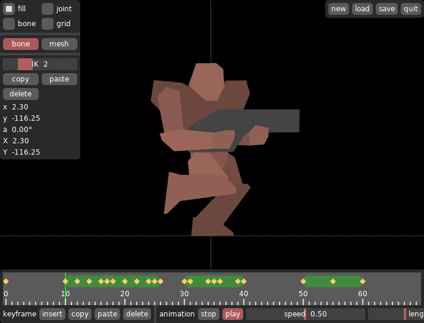
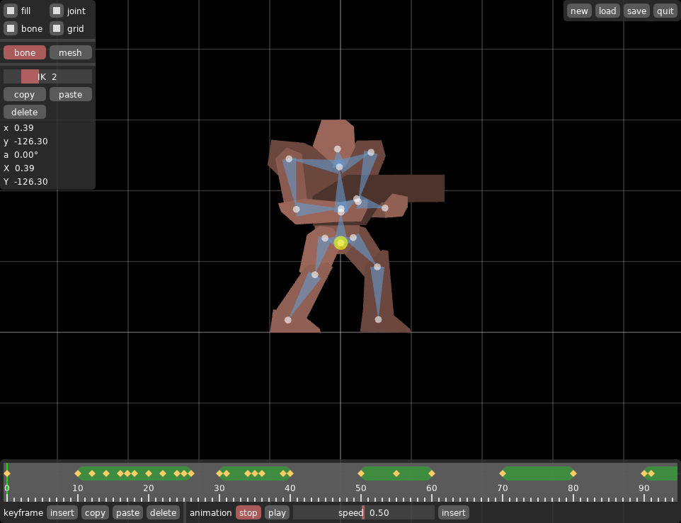

# IK

A character animation editor. The model is made up of a list of polygons.

The character and its animations for my game [VS](https://github.com/2bt/vs) were created with this tool.

## Documentation

I'm gonna mostly describe things here that aren't obvious from the GUI.

When starting the application, you should provide a name of the model file you want to edit.
Loading and saving will use this name for file operations.

    love . models/turri.model # this will open the example model

Use the mouse wheel to zoom in and out.
Drag the mouse while pressing the mouse wheel to scroll.
Press `tab` to switch between bone mode and mesh mode.

### Bone mode

There's always exactly one bone selected at all times.
Right-click to select bones.

Left-click while holding `C` to create a new bone.
The new bone will become a child of the selected bone.
Press `X` to delete the selected bone.
All child bones will also be deleted.

Drag the mouse while holding `G` to move the selected bone.
Drag the mouse while holding `R` to rotate the selected bone.
Additionally holding `shift` will give you more fine-grained control.

Drag the mouse while left-clicking to move the bone around.
This will actually only change the angels of parent bones to achieve IK.

### Mesh mode

Mesh mode let's you add, remove, and edit polygons.
You can only edit one polygon at the time.
Right-click on a polygon to select it.
This will also select all its vertices.
Right-click someplace where there's no polygon to deselect a polygon.
While there's no polygon selected, left-click while holding `C` to create a new polygon.

Press `A` to deselect all vertices.
Press `A` again to select all vertices again.
Right-click a vertex to select it.
Drag the mouse while right-clicking to box-select vertices.
Doing this while holding `shift` will add the vertices to the selection.

Left-click while holding `C` to add a vertex to the polygon.
Press `X` to delete all selected vertices.

Drag the mouse while holding `G` to move the selected vertices.
Drag the mouse while holding `R` to rotate the selected vertices.
Drag the mouse while holding `S` to scale the selected vertices.
Additionally holding `shift` will give you more fine-grained control.

Click the *assign* button to assign the selected polygon to the selected bone.
When the bone moves, assigned polygons will move with it.

